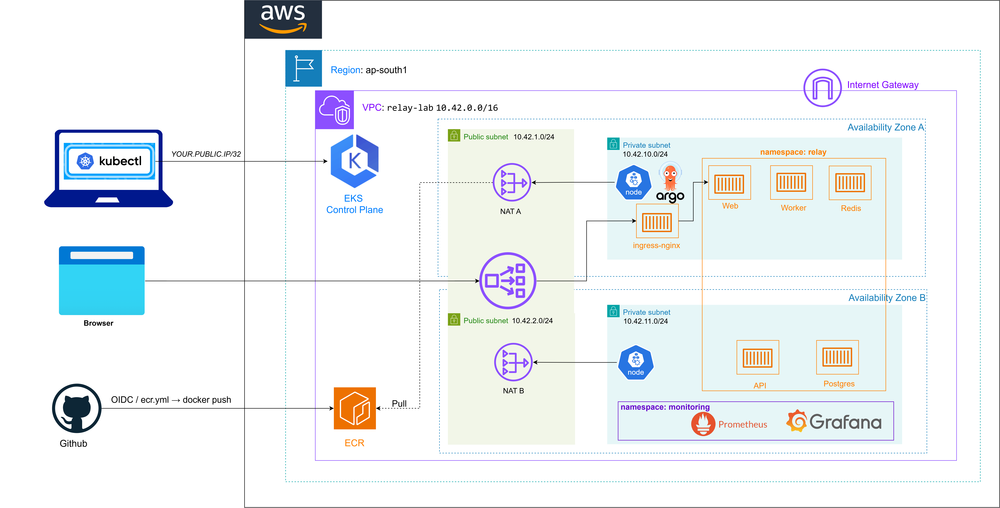

# Relay



Relay is a small **dispatch** product: a web page sends a message to an API, the API puts a job on **Redis**, a **worker** prints it. **Postgres** is there so the API can say it is really ready, not only “the process started.”

This repo is the public evidence of how that system is built and operated: Docker, Compose, GitHub Actions, Kubernetes (**kind** and **EKS**), Helm, Argo CD, Terraform on AWS, ECR, and a small Prometheus + Grafana path.

It is **not** a Kubernetes tutorial dump. Tools that do not run this product (Jenkins, Ansible, a bastion host) are out of the repo on purpose.

## Architecture

```
browser
  → AWS NLB (public subnets, HTTP)
  → ingress-nginx
  → web → API → Redis list relay:jobs → worker
                 ↓
              Postgres (readiness)
```

**kind (laptop):** same chart, no NLB. Port-forward the kind Ingress controller to `127.0.0.1:8080`. Images: `kind load`.

**EKS (ap-south-1):** nodes in private subnets (one per AZ), egress through NAT. Images in ECR. GitOps: Argo CD Application `relay-eks`. Public HTTP through an internet-facing NLB. Kubernetes API is CIDR-locked (not `0.0.0.0/0` when a `/32` is passed at apply). No bastion.

**GitOps:** GitHub `main` holds `charts/relay`. Argo CD applies it into namespace `relay`. Argo does not copy Docker images.

**CI:** `ci.yml` — Compose build, pytest, `/ready`. `ecr.yml` — OIDC (no AWS keys in GitHub) pushes `relay-api` / `relay-worker` / `relay-web` to ECR. Neither workflow `kubectl apply`s the live app.

**Metrics:** Small Prometheus in `monitoring` scrapes `http://api.relay.svc.cluster.local:8080/metrics` (cluster DNS, not the NLB). Grafana graphs `relay_jobs_queued_total`. Alert `RelayApiDown` is Inactive while that scrape is UP. kube-prometheus-stack was too heavy; it is not used.

## Layout

| Path | Role |
|---|---|
| `apps/api` | FastAPI: `/health`, `/ready`, `POST /jobs`, `/metrics` |
| `apps/worker` | Redis `brpop` on `relay:jobs` |
| `apps/web` | nginx; proxies `/health` `/ready` `/jobs` to the API (not `/metrics`) |
| `docker-compose.yml` | Local five-container run; only web publishes `8080:80` |
| `.github/workflows/ci.yml` | Build, pytest, Compose `/ready` |
| `.github/workflows/ecr.yml` | OIDC assume `relay-gha-ecr`, push three images to ECR |
| `charts/relay` | Helm chart (`values.yaml` kind names, `values-eks.yaml` ECR URLs) |
| `deploy/gitops/application.yaml` | Argo CD Application on **kind** |
| `deploy/gitops/application-eks.yaml` | Argo CD Application on **EKS** |
| `deploy/kubernetes/` | Raw YAML (how we learned; live path is Helm + Argo) |
| `deploy/observability/` | Small Prometheus + Grafana (`kubectl apply`, not the Relay Argo app) |
| `terraform/kind` | Tiny ConfigMap (Terraform + Kubernetes practice) |
| `terraform/aws` | Cheap AWS lab VPC + remote state |
| `terraform/eks` | EKS, node group, ECR, GHA OIDC role, API CIDR variable |

## Run with Compose

Needs Docker Desktop (Linux containers).

```bash
cd Relay
docker compose up -d --build
```

Open `http://127.0.0.1:8080` (not `0.0.0.0` in the browser).  
`/health` = process. `/ready` = Postgres and Redis. Queue a job from the page; worker logs show it.

`--build` after Dockerfiles or app code change. `docker compose down` removes Compose containers **and** the Compose network (use this before kind if port 8080 fights).

API `--host 0.0.0.0` is **inside** the container. The browser still uses `127.0.0.1`.

## Run on kind (GitOps)

1. Cluster `kind-relay` exists; Ingress nginx for kind is installed.
2. `docker compose down` if Compose still holds port 8080.
3. `docker compose build` then:

```bash
kind load docker-image relay-api:latest --name relay
kind load docker-image relay-worker:latest --name relay
kind load docker-image relay-web:latest --name relay
```

4. Argo CD Application `deploy/gitops/application.yaml` → path `charts/relay`, namespace **`relay`**.
5. Port-forward Ingress:

```bash
kubectl port-forward -n ingress-nginx svc/ingress-nginx-controller 8080:80
```

Open `http://127.0.0.1:8080`. After image changes: build, `kind load`, then `kubectl rollout restart deployment/api deployment/worker deployment/web -n relay` (tag `latest` often does not restart by itself).

## Run on EKS (GitOps)

kubectl context: `arn:aws:eks:ap-south-1:583966366465:cluster/relay`.

Argo CD Application `relay-eks` (`deploy/gitops/application-eks.yaml`) uses `values.yaml` + `values-eks.yaml`. Postgres uses `emptyDir` (no EBS CSI). Chart `imagePullPolicy` is `IfNotPresent`.

### Public URL (NLB)

ingress-nginx `Service` type `LoadBalancer`, internet-facing NLB in the public subnets (`kubernetes.io/role/elb=1`). The Relay Ingress (`ingressClassName: nginx`) gets that ADDRESS.

```bash
helm repo add ingress-nginx https://kubernetes.github.io/ingress-nginx
helm repo update
helm upgrade --install ingress-nginx ingress-nginx/ingress-nginx \
  --namespace ingress-nginx --create-namespace \
  --set controller.service.type=LoadBalancer \
  --set controller.service.annotations."service.beta.kubernetes.io/aws-load-balancer-scheme"=internet-facing \
  --set controller.service.annotations."service.beta.kubernetes.io/aws-load-balancer-type"=nlb

kubectl get svc -n ingress-nginx
kubectl get ingress -n relay
```

Open `http://<EXTERNAL-IP>` (HTTP only; Chrome “Not secure” means no TLS certificate). The hostname **changes** if you recreate the NLB. Do not publish Argo CD on this hostname.

Without nginx, the app is still reachable with:

```bash
kubectl port-forward -n relay svc/web 8080:80
```

That forwards **web**, not the API. Web proxies `/jobs` to the API inside the cluster.

After `ecr.yml` pushes `:latest`:

```bash
kubectl rollout restart deployment/api deployment/worker deployment/web -n relay
```

### Kubernetes API CIDR

`vpc_config.public_access_cidrs` is `var.eks_api_cidrs` (default `0.0.0.0/0`). Pass a `/32` at apply time. Do not commit your home IP. PowerShell strips `-var=` quotes; use:

```powershell
$env:TF_VAR_eks_api_cidrs = '["YOUR.PUBLIC.IP/32"]'
terraform apply
```

### GitHub Actions → ECR

Role `relay-gha-ecr`. GitHub repos created after 15 Jul 2026 send OIDC `sub` as `repo:OWNER@ID/REPO@ID:...`. The trust policy must include that pattern (and `sts:TagSession`). `id-token: write` on the workflow. CI and ECR workflows run **in parallel** when both trigger; ECR does not wait for tests.

### Argo CD UI

```bash
kubectl get applications -n argocd
kubectl port-forward svc/argocd-server -n argocd 8443:443
```

`https://127.0.0.1:8443` — user `admin`. Password from secret `argocd-initial-admin-secret` in namespace `argocd` (base64 decode). Port-forward only.

## Metrics (kind or EKS)

Same YAML. Not part of the Relay Argo app. Do not put Grafana on the public NLB.

```bash
kubectl apply -f deploy/observability/namespace.yaml
kubectl apply -f deploy/observability/prometheus.yaml
kubectl apply -f deploy/observability/grafana.yaml
kubectl -n monitoring port-forward svc/prometheus 9090:9090
kubectl -n monitoring port-forward svc/grafana 3001:3000
```

Prometheus: `http://127.0.0.1:9090` → Status → Targets → `relay-api` UP. Query `relay_jobs_queued_total`.  
Grafana: `http://127.0.0.1:3001` (admin / `relay-lab`).

`/metrics` is **not** on the public HTTP path (web nginx does not proxy it). Prometheus scrapes the API Service inside the cluster.

## Tear down and bring back

NAT, EKS control plane, nodes, and the NLB **bill** while they exist.

### Only remove the public load balancer

```bash
helm uninstall ingress-nginx -n ingress-nginx
```

Cluster, Argo, Relay, ECR images stay. The old ELB hostname dies.

Install nginx again with the Helm command under **Public URL (NLB)**. Wait for a **new** `EXTERNAL-IP`.

### Destroy the EKS Terraform stack

```bash
helm uninstall ingress-nginx -n ingress-nginx
cd terraform/eks
terraform destroy
```

Uninstall nginx **first** so AWS deletes the NLB. This destroy removes the cluster, nodes, NAT, ECR **repositories (images gone)**, and IAM roles (`relay-eks-*`, `relay-gha-ecr`). `terraform/aws` (lab VPC + state bucket) stays. GitHub YAML stays.

**`terraform apply` is only the AWS half.** It does **not** restore Argo, images, nginx, or Grafana. After apply:

1. Set `TF_VAR_eks_api_cidrs` if you want the API locked.
2. `aws eks update-kubeconfig --region ap-south-1 --name relay`
3. Push images (`ecr.yml` on `main`, or local `docker push`) — ECR is empty
4. Install Argo CD; `kubectl apply -f deploy/gitops/application-eks.yaml`
5. Helm install ingress-nginx (same command as above)
6. Optional: `kubectl apply -f deploy/observability/`

Do not commit `*.tfstate` or `cidr.tfvars`.

## What this repo is not

- **Jenkins** — CI is GitHub Actions.
- **Ansible** — no VM/bastion. GitOps owns the cluster.
- **kube-prometheus-stack** — too heavy next to the app; small Prometheus instead.
- **TLS on the NLB** — HTTP only in this lab. ACM + Ingress TLS would be the next hardening step.
- **RDS / EBS CSI** — Postgres is in-cluster `emptyDir`. Fine for a demo, not durable data.

Those tools still belong in interviews. Jenkins/Ansible belong in a **later** repo if a VM or a Jenkins job is real.

## 📚 Medium Articles

- [Learn and Build DevOps With Me: Building Relay Project From Laptop to AWS](https://medium.com/@sheshanhebron61/learn-and-build-devops-with-me-building-relay-from-laptop-to-aws-e6fce6c55faf)
- [Relay on AWS EKS: A Production-Shaped DevOps Architecture](https://medium.com/@sheshanhebron61/relay-on-aws-eks-a-production-shaped-devops-architecture-6f3cfa2bbfec)

## License

Use as a portfolio/study project.
